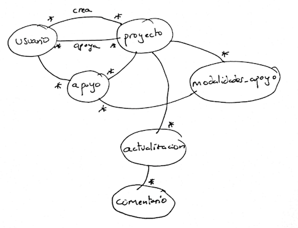

# Práctica 0. Diseño inicial de la aplicación y del dominio

En las prácticas de la asignatura debéis desarrollar una aplicación web en el dominio que vosotros queráis: puede ser desde vuestro propio Netflix hasta un UACloud pasando por cualquier tipo de app web. Evidentemente hay funcionalidades muy complicadas de implementar, típicamente apps que necesiten de  *streaming* (como ese "tu propio Netflix") o de una infraestructura u operaciones muy complejas en el servidor (por ejemplo una interfaz web para ejecutar contenedores docker en la nube). En ese caso tenéis la opción de no implementar esa parte (un "Netflix" que sea solo un catálogo de películas aunque no se puedan ver) o iros a otro dominio.

## El documento de diseño de la aplicación

El objetivo de esta primera entrega es escribir un documento "versión 0.1" sobre la aplicación con:

- **Descripción y alcance**. Explicad brevemente qué aplicación queréis desarrollar, para qué sirve y cuáles serán sus características principales. Si alguna funcionalidad queda deliberadamente fuera del alcance de la primera versión, indicadlo.
- **Funcionalidades del frontend**. Indicad las principales acciones que podrá realizar el usuario desde la aplicación.
- **Tipo de backend**. Indicad qué solución utilizaríais inicialmente (por ejemplo Supabase/BaaS o un backend propio con Express y una API REST) y justificad brevemente la decisión. Esta elección es provisional y podrá cambiar posteriormente.
- **Responsabilidades del backend**. Indicad qué datos deberá mantener el servidor, qué operaciones deberá proporcionar al frontend y qué reglas de acceso o de negocio deberá garantizar.
- **Modelo de datos**. Representad las principales entidades o conceptos del dominio, sus relaciones y los atributos que consideréis importantes. No es necesario definir todavía el esquema SQL ni utilizar ninguna herramienta específica de modelado. El modelo deberá incluir al menos tres entidades del dominio relacionadas entre sí, sin contar la entidad de usuario, que aparecerá en la mayoría de las aplicaciones. Por ejemplo en una app para que los usuarios comenten películas podría haber usuarios, películas, actores y comentarios.

> Se entiende que el *backend* servirá datos al frontend, no HTML. El encargado de pintar el HTML será el *frontend*. Cómo funciona esto ya lo iremos viendo con más detalle en la asignatura

**No debéis escribir todavía nada de código, ni de back ni de front**, eso lo haremos a partir de la semana que viene.

El documento con las funcionalidades y el modelo de datos **no es necesario que ocupe más de 2 páginas** aunque se permite que os extendáis algo más si lo queréis especificar con más detalle. Se tratará de una versión preliminar, de modo que nada os impedirá cambiar las decisiones de diseño más adelante (añadir o eliminar alguna funcionalidad, cambiar el modelo de datos, ...)

## Ejemplo de documento de diseño

Se pretende desarrollar una aplicación web para alojar y apoyar económicamente proyectos de *crowdfunding* (al estilo de Kickstarter o Verkami). En el sitio aparecerán los últimos proyectos o más populares, se podrán buscar por contenido o tipo de proyecto y el usuario podrá ver información sobre ellos, apoyarlos económicamente si se ha dado de alta, estar al tanto de las novedades de los proyectos que ya apoya, etc. 

La implementación real de los pagos queda fuera del ámbito de la aplicación por su complejidad, usaremos pagos simulados.

### Funcionalidades del frontend

* Un usuario sin estar autentificado debe poder ver los datos más importantes de la lista de proyectos más populares en el sitio
* Un usuario sin estar autentificado debe poder ver todos los datos de un proyecto
* Un usuario autentificado debe poder elegir una modalidad de apoyo y apoyar un proyecto con esa cantidad
* Un usuario debe poder darse de alta con un email y una contraseña
* Un usuario dado de alta debe poder hacer login en la aplicación
* Un usuario logueado debe poder crear un nuevo proyecto con datos básicos: título, texto, objetivo financiero, ...
* Un usuario logueado y que ha creado un proyecto debe poder añadir modalidades de apoyo a un proyecto (cantidad aportada y recompensa obtenida a cambio)
* Un usuario logueado y que ha creado un proyecto debe poder enviar actualizaciones (==noticias) sobre el estado del mismo
* Un usuario debe poder cerrar la sesión (logout)

### Backend

Usaremos un backend basado en Supabase ya que las funcionalidades que ofrece esta plataforma son más que suficientes para implementar la aplicación, y resultará más sencillo que si usamos un backend propio en Express u otra plataforma

El backend debe permitir:

- Gestionar usuarios y autenticación.
- Almacenar proyectos, modalidades de apoyo, apoyos y actualizaciones.
- Permitir consultar proyectos, incluyendo búsquedas y ordenación por fecha/popularidad.
- Permitir crear y modificar proyectos únicamente a sus propietarios.
- Permitir registrar un apoyo de un usuario a una modalidad de un proyecto.
- Garantizar que un usuario no pueda modificar proyectos, modalidades o actualizaciones de otro usuario.
- Calcular u ofrecer los datos necesarios para conocer cuánto dinero ha recaudado un proyecto.
- En esta primera versión, el pago económico puede ser simulado y no es necesario integrar una pasarela real.

### Modelo de datos

Usaremos el modelo de datos que aparece en la siguiente figura

> Nota: como veis
 - No es necesario hacer un diagrama "bonito" con ningún software especial 
 - Aunque os hayáis decidido por una BD en el servidor (en nuestro caso PostgreSQL, que es la BD de Supabase) no es necesario que especifiquéis el esquema SQL, basta con el modelo de datos "en abstracto", aunque podéis hacerlo si queréis.

La entrega se podrá realizar por moodle hasta el **28 de septiembre a las 23:59**.