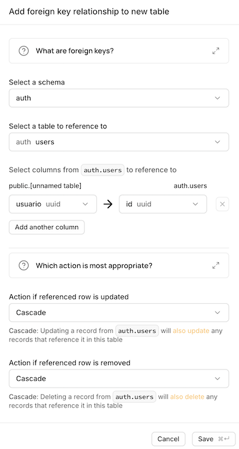

# Introducción a Supabase

Supabase es una plataforma **Backend as a Service (BaaS)** que proporciona gran parte de la funcionalidad necesaria para desarrollar el *backend* de una aplicación sin tener que implementarlo desde cero.

Entre sus principales servicios están:

- **Base de datos**: cada proyecto Supabase incluye una base de datos PostgreSQL. Supabase proporciona además un API para poder acceder a sus tablas desde nuestras aplicaciones.
- **Gestión de usuarios y autenticación**: registro de usuarios, login, logout, recuperación de contraseña, autenticación mediante servicios externos como Google o GitHub, etc.
- **Autorización mediante Row Level Security (RLS)**: podemos especificar qué filas de una tabla puede consultar o modificar cada usuario.
- **Realtime**: una aplicación puede recibir notificaciones cuando cambian los datos almacenados en determinadas tablas. También podemos mandar mensajes en tiempo real a todos los usuarios.
- **Storage**: permite almacenar archivos subidos por los usuarios, como imágenes, audios o documentos.
- **Edge Functions**: permite ejecutar funciones en el servidor para implementar lógica que no queremos ejecutar en el navegador.

En esta introducción usaremos fundamentalmente los tres primeros servicios: **base de datos, autenticación y autorización**.

> Supabase tiene una particularidad interesante: usa una base de datos "estándar" y abierta que es **PostgreSQL**. Algunas de las funcionalidades que veremos, como Row Level Security, son funcionalidades del propio PostgreSQL y no de Supabase.

## Crear un proyecto

Para estas primeras prácticas utilizaremos Supabase alojado en la nube. **Necesitarás [darte de alta](https://supabase.com/dashboard/sign-up?returnTo=%2Fnew) en Supabase, aunque también puedes entrar con tus credenciales de Github o ChatGPT**.

[Entra en el Dashboard de Supabase](https://supabase.com/dashboard/sign-in) y crea un nuevo proyecto. Tienes que elegir un nombre para el mismo y una contraseña para la base de datos asociada **Esta contraseña no se puede luego recuperar, solo resetear, guárdala en un lugar seguro**.

Puedes dejar las opciones marcadas por defecto.

El *dashboard* de administración del  proyecto es bastante complejo y tiene muchas opciones, aquí usaremos solo las estrictamente necesarias para lo que queremos hacer.

Vamos a desarrollar el mismo ejemplo que usaremos a lo largo de esta introducción: una aplicación para gestionar la **lista de la compra**. Cada usuario tendrá una lista con los productos que quiere comprar.

Cada elemento tendrá:

- un nombre,
- un campo booleano que indique si ya se ha comprado,
- el usuario al que pertenece.

## Usuarios

Supabase mantiene los usuarios de la aplicación separados de las tablas que creamos nosotros.

Desde el Dashboard podemos crear inicialmente algún usuario de prueba. En una aplicación real, normalmente los propios usuarios se registrarían utilizando el API de autenticación.

En la barra de herramientas de la izquierda, ve a `Authorization` y crea un usuario (botón verde `Add User`) con un email y contraseña que recuerdes, ya que lo utilizaremos posteriormente para probar el API.

Supabase asignará automáticamente a cada usuario un identificador de tipo **UUID** como `7bd8a6d4-7ca9-42ad-a833-3e67...`. Este identificador nos permitirá relacionar los datos de nuestra aplicación con el usuario al que pertenecen.

## Tablas

Vamos a crear una tabla llamada `lista`. Cada fila representará un elemento de la lista de la compra de un usuario.

La tabla tendrá los siguientes campos:

- `id`: identificador autogenerado.
- `nombre`: texto 
- `comprado`: booleano.
- `usuario`: identificador del usuario propietario del elemento.

El campo `usuario` debería ser de tipo `uuid` y una **clave ajena** hacia el campo `id` de los usuarios gestionados por Supabase Auth.

Podemos crear la tabla utilizando la interfaz gráfica o directamente mediante SQL pero os recomiendo hacerla gráficamente con el `Table editor` de la barra de la izquierda para ver su uso.

- Escribid el nombre `lista` y opcionalmente la descripción `lista de la compra`
- IMPORTANTE: Desmarcad la casilla `Enable Row Level Security`. Esto hará que cualquiera pueda leer/escribir en la tabla, pero nos vendrá bien de momento para pruebas.
- por defecto ya hay una columna `id` con un identificador autogenerado y una `created_at` con la fecha de creación de cada registro. **Podéis añadir las tres que faltan: `nombre` (tipo `text`), `comprado` (tipo `bool`) y `usuario` (tipo `uuid`).**
- El campo `usuario` debe ser una clave ajena a la tabla `users` del *schema* `auth` de Supabase. Esa tabla es la que editamos antes de manera visual con los usuarios. Añadid la restricción de clave ajena con el botón `Add foreign key relation` en la parte baja de la pantalla.



Una vez creada la tabla, en la herramienta `Table Editor` añade manualmente un par de filas asociadas al usuario de prueba para poder comprobar posteriormente que nuestra aplicación puede recuperarlas.

> No rellenes el `id` ni el `created_at`, se hace automáticamente. En el campo `usuario`, en el icono del lápiz tienes la opción `select record`con la que puedes elegir visualmente el usuario para no tener que copiar manualmente su *uuid*.

## El API JavaScript

Supabase proporciona un SDK oficial para JavaScript denominado `supabase-js`.

> Aunque Supabase genera automáticamente un API REST para poder acceder a las tablas de la base de datos, normalmente desde JavaScript utilizaremos este SDK, que ofrece una interfaz más cómoda.

Habitualmente el código para llamar al backend Supabase residiría en el navegador. Como por el momento no hemos empezado todavía con la programación JS en el navegador, para estas primeras pruebas utilizaremos Node para ejecutar los ejemplos. No es necesario conocer de momento Node: basta por ahora con seguir los pasos de creación del proyecto e instalación de dependencias.

### Crear un proyecto

Crea una carpeta para el proyecto:

```bash
mkdir demo-supabase
cd demo-supabase
npm init -y
```

Edita el `package.json` y cambia `"type":"commonjs"` por

```json
"type": "module"
```

si no estaba `type`, añádelo con el valor anterior.


Instala el SDK:

```bash
npm install @supabase/supabase-js
```

Para utilizar Supabase necesitamos dos datos de nuestro proyecto, que pueden obtenerse en el *dashboard*:

- la **URL del proyecto**, disponible en la opción `project overview` de la barra izquierda. Podemos copiarla con el botón `Copy`.
- la **publishable key** del proyecto. En el mismo botón `Copy` de antes.

> Supabase posee también `Secret keys` que **no deben incluirse nunca en código que vaya a ejecutarse en el lado del cliente**.

## Crear el cliente

El código cliente js lo meteremos en un archivo `index.js`.

Podemos inicializar el cliente de Supabase y lanzar una *query* de prueba de esta forma:

```javascript
import { createClient } from "@supabase/supabase-js"

const SUPABASE_URL = "URL_DE_TU_PROYECTO"
const SUPABASE_KEY = "PUBLISHABLE_KEY_DE_TU_PROYECTO"

const supabase = createClient(SUPABASE_URL, SUPABASE_KEY)

const { data, error } = await supabase
  .from("lista")
  .select("*")

console.log("data:", data)
console.log("error:", error)
```

Y lo ejecutamos desde la terminal con `node index.js`. Deberían aparecer los datos de los dos registros introducidos antes, y el error debería ser `null`.

> Si lo pensáis bien, hemos accedido a la información de la lista de la compra de un usuario sin necesidad de autentificarnos. Si la aplicación fuera real esto estaría horriblemente mal. Esto ha sucedido porque al crear la tabla lista hemos desactivado la "Row Level Security". Luego veremos cómo gestionar la autorización con las llamadas políticas de acceso.

### Autentificarse

Para hacer *login* en la aplicación con email y contraseña:

```javascript
const { data, error } = await supabase.auth.signInWithPassword({
    //SUSTITUIDLO por los que hayáis puesto vosotros
    email: "pepe@ua.es",
    password: "pepe"
})

if (error) {
    console.log(error.message)
}
else {
    console.log("Usuario:", data.user)
}
```

El resultado contiene información sobre el usuario y sobre la sesión creada. Podemos consultar por ejemplo el UUID del usuario autentificado, `data.user.id`. 

La sesión contiene además un **access token** que Supabase utilizará posteriormente al hacer peticiones al *backend*. El SDK se encarga normalmente de incluir automáticamente las credenciales necesarias en las peticiones posteriores. Veremos en clase de teoría cómo funciona esto internamente.

## Trabajar con la base de datos

Supabase tiene un API JS similar a SQL pero con un nivel de abstracción algo mayor. Ya hemos visto cómo hacer selects simples.

```javascript
const { data: lista, error } = await supabase
    .from("lista")
    .select()

if (error) {
    console.log(error.message)
}
else {
    for (const item of lista) {
        console.log(
            item.nombre,
            item.comprado ? "comprado" : "pendiente"
        )
    }
}
```
Naturalmente, podemos utilizar filtros cuando los necesitemos. Por ejemplo, para recuperar solo los elementos pendientes:

```javascript
const { data, error } = await supabase
    .from("lista")
    .select()
    .eq("comprado", false)
```

Cuando tenemos relaciones entre tablas podemos recuperar los datos sin necesidad de hacer explícitamente un JOIN, supongamos que tuviéramos el clásico ejemplo de departamentos y empleados.

```text
departamentos
- id
- nombre

empleados
- id
- nombre
- departamento_id -> departamentos.id
```

Podemos hacer:

```javascript
const { data, error } = await supabase
  .from('departamentos')
  .select(`
    id,
    nombre,
    empleados (
      id,
      nombre
    )
  `)
```

Supabase es lo suficientemente "listo" como para saber que `empleados` es la tabla que contiene la clave ajena que vincula empleado con departamento, y sacar así la lista de empleados como un objeto JS anidado:

```javascript
[
  {
    id: 1,
    nombre: "Contabilidad",
    empleados: [
      { id: 10, nombre: "Ana" },
      { id: 11, nombre: "Paco" }
    ]
  }
]
```
incluso funciona con relaciones muchos a muchos, si tuviéramos `proyectos` de modo que un proyecto engloba a varios `empleados` y un empleado puede estar en varios proyectos, necesitaríamos la típica tabla auxiliar para relacionarlos, digamos `miembros(empleado_id, proyecto_id)`. Y podríamos hacer una consulta como:

```javascript
supabase
  .from('empleados')
  .select(`
    nombre,
    proyectos (
      nombre
    )
  `)
```

Sin tener que mencionar explícitamente la tabla `miembros` que relaciona `empleados` y `proyectos`. Para más información consultad la documentación de Supabase.

Podemos **crear un elemento** con `insert`. Como en la lista de la compra cada registro tiene el id del usuario, tenemos que autentificarnos primero:

```javascript
//supongamos que userData es el primer objeto devuelto por signInWithPassword
const datos = {
    nombre: "zumo",
    comprado: false,
    usuario: userData.user.id
}
const { error } = await supabase
    .from("lista")
    .insert(datos)
if (error) {
    console.log(error.message)
}
```
Por defecto `insert()` no devuelve la fila insertada. Si queremos recuperarla podemos encadenar `select()`:

```javascript
const { data, error } = await supabase
    .from("lista")
    .insert({
        nombre: "zumo",
        comprado: false,
        usuario: userData.user.id
    })
    .select()
```

No ponemos ejemplos de `update` o `delete` por no extendernos demasiado, podéis buscar en la documentación de Supabase o preguntarle a un LLM.

### Logout

Para cerrar la sesión:

```javascript
const { error } = await supabase.auth.signOut()
```

El SDK dejará entonces de realizar las siguientes peticiones como ese usuario.


## Autorización con Row Level Security

Aquí aparece un problema importante. Nuestro código JavaScript normalmente se ejecutará en el navegador del usuario. Por tanto **no podemos confiar en ese código**.

Aunque nuestra aplicación compruebe que el usuario está autenticado antes de lanzar una petición al *backend* y solo muestre los elementos pertenecientes al usuario autentificado, cualquiera podría:

- modificar el código JavaScript,
- llamar directamente a la API desde la consola de las *devtools* del navegador
- cambiar los parámetros de una petición,
- lanzar sus propias peticiones HTTP.

Por tanto la autorización debe comprobarse también en el servidor. Supabase utiliza para ello principalmente una funcionalidad de PostgreSQL llamada **Row Level Security (RLS)**. RLS permite establecer políticas que determinan qué filas puede consultar, insertar, modificar o borrar un determinado usuario.

Podemos ver **una política RLS como una regla que añade automáticamente condiciones a las operaciones SQL** que realiza la aplicación del cliente.

Por ejemplo, si establecemos una política que solo permite acceder a las filas cuyo campo `usuario` coincide con el usuario autentificado, una operación conceptualmente equivalente a:

```sql
select * from lista;
```

se comportará para ese usuario aproximadamente como:

```sql
select *
from lista
where usuario = usuario_actual;
```

La diferencia fundamental es que **la condición la aplica la base de datos**, no nuestro código JavaScript, y por tanto el código no se la puede saltar.

### Activar RLS

Para utilizar políticas debemos activar primero Row Level Security sobre la tabla. En el `Table Editor` podemos pulsar el botón rojo que ahora pone `RLS Disabled` para cambiar el estado.

> También podríamos hacerlo manualmente en el `SQL Editor`

> ```sql
> alter table lista enable row level security;
> ```

Una vez activado RLS, tendremos que indicar explícitamente qué operaciones están permitidas, especificando las reglas de acceso, también llamadas **políticas**.

De hecho, si probamos el código Javascript de antes, veremos que ya no obtenemos ningún dato. Por defecto **salvo que especifiquemos una política de acceso para una operación (en este caso `select`) esta no se permitirá**.

Las políticas se expresan con una sintaxis propia de postgreSQL. Iremos viendo ejemplos de estas expresiones, de momento saber que una política cubre un tipo de operación (`select`, `insert`) y unas condiciones (por ejemplo estar autenticado o que el usuario autenticado sea el que aparece en determinado campo del registro).

### Política para select

Queremos que cada usuario solo pueda ver los productos de su lista de la compra. La política sería algo como:

```sql
create policy "leer solo tu lista de la compra"
on lista
for select
to authenticated
using (
    (select auth.uid()) = usuario
);
```

Esta política indica que:

- sobre la tabla `lista`
- para la operación de `select`
- en caso de que el usuario esté autenticado `authenticated`
- la condición es que el campo `usuario` del registro tenga el mismo valor que el UUID del usuario autentificado en la petición.

> En la sección `templates` podemos buscar políticas típicas ya predefinidas, esta se correspondería con la *template* `Enable users to view their own data only`.

Si una petición no se corresponde con ninguna política, por defecto no se puede ejecutar. Siguiendo el ejemplo anterior, un `select` sin haber hecho *login* (no autenticada o como dice Supabase, anónima - `anon`) devolvería 0 registros.

Si volvemos a probar el código Javascript de antes veremos que 

```javascript
supabase
    .from("lista")
    .select()
```

devuelva solo los datos del usuario autentificado, como si hubiéramos añadido:

```javascript
.eq("usuario", usuarioActual.id)
```

## Política para crear elementos

Un usuario autentificado debería poder crear elementos, el caso problemático es que los pueda crear asignándoselos a otro usuario.

Para las operaciones `insert`, PostgreSQL utiliza la cláusula `with check`. 

> La diferencia es que `using` filtra las filas que ya existen mientras que `with check` es para chequear una fila nueva. Una operación `update` podría llevar las dos.

```sql
create policy "crear solo elementos propios"
on lista
for insert
to authenticated
with check (
    (select auth.uid()) = usuario
);
```

Con esta política una fila solo podrá insertarse si el campo `usuario` coincide con el usuario autentificado.

Por tanto, aunque alguien manipule el código y haga:

```javascript
{
    nombre: "1000 kg de brócoli",
    comprado: false,
    usuario: "ID-DE-OTRO-USUARIO"
}
```

la base de datos rechazará la operación.

## Actualizar y borrar

Para actualizar un elemento queremos comprobar dos cosas:

1. que el elemento existente pertenece al usuario;
2. que tras modificarlo siga perteneciendo al mismo usuario.

Podemos expresarlo así:

```sql
create policy "actualizar elementos propios"
on lista
for update
to authenticated
using (
    (select auth.uid()) = usuario
)
with check (
    (select auth.uid()) = usuario
);
```

Para borrar:

```sql
create policy "borrar solo elementos propios"
on lista
for delete
to authenticated
using (
    (select auth.uid()) = usuario
);
```

> Es importante observar que RLS no es un mecanismo particular del SDK JavaScript de Supabase. Las políticas están en PostgreSQL y se aplican independientemente de cómo llegue la petición a la base de datos a través del API. Por otro lado otras plataformas BaaS aplican la misma idea ya que tienen el mismo problema de la falta de confianza en el código del cliente. Por ejemplo en Firebase las "políticas" se llaman `security rules` y la sintaxis es distinta ya que la base de datos también lo es. En Pocketbase, que también introduciremos brevemente en el curso, se llaman API rules. Eso no quiere decir que las políticas o similares sean la única forma de controlar la autorización, por ejemplo en la plataforma `Parse` que tuvo mucha popularidad hace años, cada "registro" tenía sus propios permisos, una ACL (Access Control List) de manera similar a como cada archivo en Unix o Windows NTFS tiene permisos de acceso.

## ¿Qué hay debajo del SDK?

Aunque estamos utilizando métodos JavaScript como:

```javascript
supabase
    .from("lista")
    .select()
```

es importante no confundir el **SDK** con el **backend**.

Simplificando, la arquitectura es:

```text
Código JavaScript
       │
       │ supabase-js
       ▼
    API HTTP
       │
       ▼
   PostgreSQL
       │
       └── políticas RLS
```

El SDK JavaScript construye peticiones a un API HTTP de tipo REST proporcionado por Supabase. Podríamos haher usado directamente la API REST en lugar del SDK Javascript pero los ejemplos serían más tediosos de escribir. Por ejemplo:


```javascript
const SUPABASE_URL = "LA-URL-DEL-PROYECTO"
const SUPABASE_KEY = "LA-PUBLISHABLE-KEY"

const response = await fetch(
  `${SUPABASE_URL}/rest/v1/lista`,
  {
    headers: {
      apikey: SUPABASE_KEY
    }
  }
)

const datos = await response.json()
console.log(datos)
```

En las próximas sesiones estudiaremos con más detalle las **APIs web**, de modo que podamos entender mejor qué está haciendo por nosotros el SDK.
