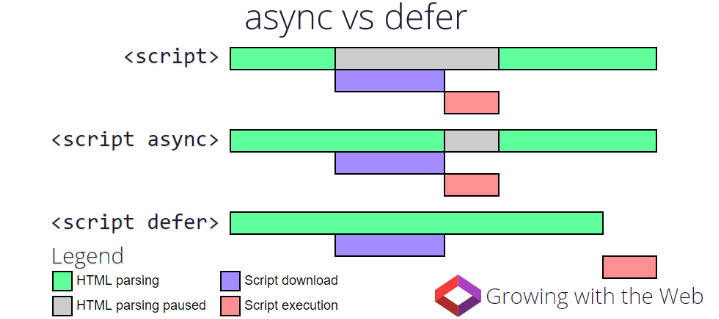
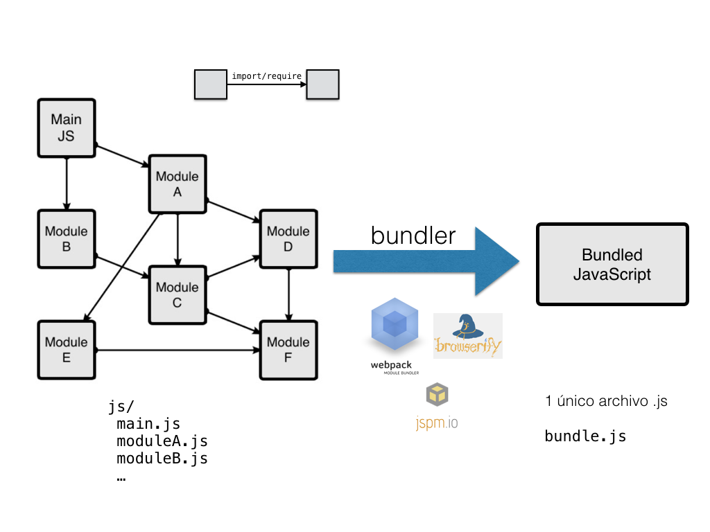
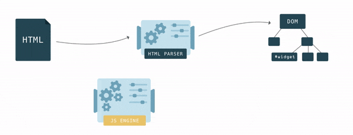
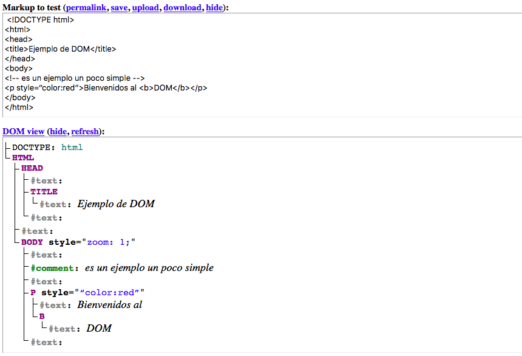

<!-- .slide: class="titulo" -->

# Tema 4: Javascript en clientes web: 
## Parte I: introducción, eventos y API del DOM


---

<!-- .slide: class="titulo" -->


## Javascript en el cliente: conceptos básicos

---

En el principio Javascript y el desarrollo *frontend* era **esto**


```html
<h1>Mi web</h1>
<script>
  alert("¡¡Bienvenido a mi web!!")
</script>
```

La web de los 90s: [https://sophieswebsite1999.neocities.org/](https://sophieswebsite1999.neocities.org/)

---

Pero el desarrollo *frontend* actual no es trivial


[https://x.com/wycats/status/930463710941872128?s=20](https://x.com/wycats/status/930463710941872128?s=20)

---

## Insertar JS en el HTML

- En etiquetas `<script>`
- El ámbito de las variables y funciones definidas en el "primer nivel" es la *página*
- Por defecto el JS se *parsea* y ejecuta conforme se va leyendo

```html
<html>
<head>
  <script>   
    //esto define la función pero no la llama todavía
    function ahora() {            
       let now = new Date();    
       return now.toLocaleString(); }
    let verFecha = true;
   </script>
   <!-- podemos cargar JS externo con un tag vacío y su URL en el src -->
   <script src="otroscript.js"></script>
</head>
<body>
   <script>
      //la variable es visible por estar definida antes en la misma página
      if (verFecha)
        alert("Fecha y hora: " + ahora());
   </script>
</body>
</html>
```

---

## Carga de *scripts* externos

Forma "clásica": con el atributo `src` en un `<script>` vacío conseguimos una especie de "include". Todo lo que incluímos está en el mismo "espacio de nombres"

```html
<!-- Ejemplo en https://codepen.io/editor/ottocol/pen/01a0e774-11a5-78da-9cc1-b3d8ab9c8214 -->
<link rel="stylesheet" href="https://unpkg.com/leaflet@1.9.4/dist/leaflet.css">
<div id="mapa" style="height: 300px"></div>
<script src="https://unpkg.com/leaflet@1.9.4/dist/leaflet.js"></script>
<script>
  const mapa = L.map("mapa").setView([40.4168, -3.7038], 13);
  L.tileLayer("https://tile.openstreetmap.org/{z}/{x}/{y}.png", {
    attribution: "© OpenStreetMap contributors"
  }).addTo(mapa);
  L.marker([40.4168, -3.7038]).addTo(mapa);
</script>
```
- Cada `<script src="">` define nombres **globales**
- Con muchas dependencias, es tedioso (por la cantidad de `script src`) y problemático (por colisiones en los nombres o tener que gestionar el orden de las dependencias, si hay relaciones entre ellas)


---

Por defecto al encontrar un *script* se interrumpe la carga del HTML hasta que se acabe de cargar,_parsear_ y ejecutar el *script*. Por ello típicamente __se recomendaba colocar los scripts al final__, así el usuario no ve una página en blanco. 

Con *scripts* externos podemos usar los atributos `defer` o `async` 

[https://www.growingwiththeweb.com/2014/02/async-vs-defer-attributes.html](https://www.growingwiththeweb.com/2014/02/async-vs-defer-attributes.html)
<!-- .element class="caption"-->




---

## Módulos ESM


```javascript
//archivo modulo_saludo.js

const saludos = ["Hola", "Qué tal", "EEEHH"]  //no visible desde fuera 

function saludar(nombre) {
  return `${saludos[Math.floor(Math.random()*saludos.length)]}, ${nombre}`
}

export {saludar}
```

```javascript
//archivo main.js (hace uso del modulo_saludo)
import {saludar} from './modulo_saludo.js'
console.log(saludar('Pepe'))
```

Hay muchas formas de [import](https://developer.mozilla.org/es/docs/Web/JavaScript/Reference/Statements/import)<br>

```html
<!-- en el HTML -->
<script type="module" src="main.js"></script>
```


---

## Bundlers y soporte de ESM en el navegador

- La necesidad de usar módulos en *frontend* surgió antes de que ESM se implementara en los navegadores más usados
- *Bundler*: una herramienta que puede transformar los módulos en un único archivo cargado con `<script src="">`




---

## Bundlers

- Típicamente ofrecen compatibilidad con módulos ESM y CommonJS (sistema de módulos de Node - `require` vs `import`)
- Además el *bundler* puede realizar operaciones adicionales como:
  * Llamar a un transpilador para traducir el código de ES6 a ES5
  * *minificar* el código
  * copiar los *assets* (jpg, png, ...)
  * ...
- Ejemplos: webpack, vite, parcel, rollup, esbuild ...
- Veremos su uso en prácticas

---

## Acceso a las APIs nativas del navegador

- El navegador incluye "de serie" multitud de APIs, para: gestión de eventos, manipulación del HTML, comunicación con el servidor, guardar datos en local, dibujar gráficos,...
- Hay una serie de "objetos globales predefinidos" de los que "cuelgan" estas APIs, por ejemplo
  + `window`: el objeto global por defecto, todo lo que definimos está dentro de él.
  + `document`: la página actual
  + `navigator`: el navegador


---

<!-- .slide: class="titulo" -->


## Acceso al HTML y manipulación del contenido: la API del DOM

---

**DOM** (*Document Object Model*): por cada etiqueta o componente del HTML actual hay en memoria un objeto Javascript equivalente. 

Los objetos JS forman un árbol en memoria, de modo que un nodo del árbol es "hijo" de otro si el elemento HTML correspondiente está *dentro* del otro.

**API DOM**: conjunto de APIs que nos permite acceder al DOM y manipularlo. Al manipular los objetos JS estamos cambiando indirectamente el HTML *en vivo* 



---

## El árbol del DOM

[Live DOM Viewer](https://software.hixie.ch/utilities/js/live-dom-viewer/?%20%3C!DOCTYPE%20html%3E%0A%3Chtml%3E%0A%3Chead%3E%0A%3Ctitle%3EEjemplo%20de%20DOM%3C%2Ftitle%3E%0A%3C%2Fhead%3E%0A%3Cbody%3E%0A%3C!--%20es%20un%20ejemplo%20un%20poco%20simple%20--%3E%0A%3Cp%20style%3D“color%3Ared”%3EBienvenidos%20al%20%3Cb%3EDOM%3C%2Fb%3E%3C%2Fp%3E%0A%3C%2Fbody%3E%0A%3C%2Fhtml%3E)




---
